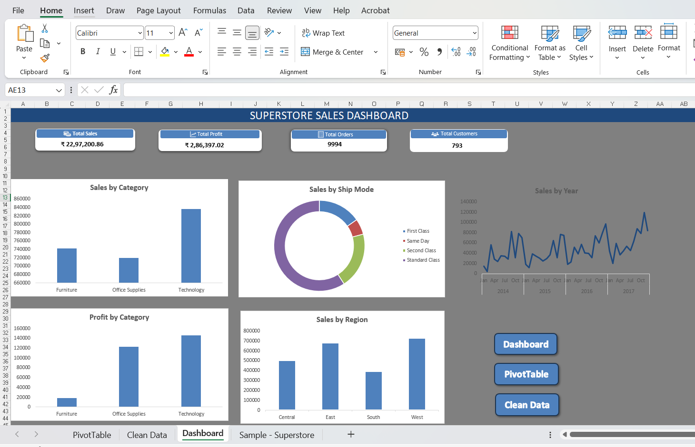
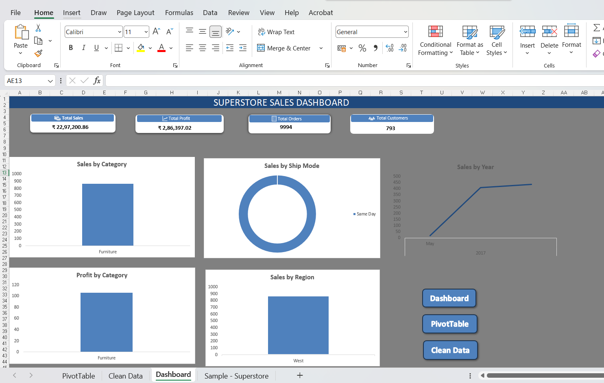

# 📊 Interactive Superstore Sales Dashboard (Microsoft Excel)

## 📌 Project Overview

This project is an interactive **Sales Dashboard** built in **Microsoft Excel** to analyze sales performance using the Sample Superstore dataset.

The dashboard enables users to monitor key business metrics, explore sales trends, and analyze performance by category, region, customer segment, and shipping mode through interactive filters.

---

## 🚀 Features

- 📈 Interactive KPI Cards
  - Total Sales
  - Total Profit
  - Total Orders
  - Total Customers

- 📊 Dynamic Charts
  - Sales Trend Analysis
  - Sales by Category
  - Profit by Category
  - Sales by Region
  - Sales by Ship Mode

- 🎛 Interactive Slicers
  - Category
  - Region
  - Segment
  - Ship Mode

- 📅 Timeline Filter
  - Analyze sales by Year and Month

- 🧹 Data Cleaning
  - Power Query
  - Duplicate Removal
  - Date Conversion
  - Data Validation

---

## 🛠 Tools & Technologies

- Microsoft Excel
- Power Query
- Pivot Tables
- Pivot Charts
- Slicers
- Timeline
- Dashboard Design
- Data Cleaning
- Data Visualization

---

## 📷 Dashboard Preview

### Main Dashboard

---

### Interactive Dashboard

Example showing dashboard filtered using slicers.

---

## 📈 Business Insights

The dashboard helps answer business questions such as:

- Which category generates the highest sales?
- Which region performs best?
- Which ship mode contributes the most sales?
- How has sales changed over the years?
- What is the overall business profit?
- How many unique customers and orders are there?

---

## 📂 Files Included

- 📄 Superstore-Sales-Dashboard.xlsx
- 📄 Superstore-Sales-Dashboard.pdf
- 🖼 dashboard-full.png
- 🖼 dashboard-filtered.png

---

## 🎯 Skills Demonstrated

- Data Cleaning
- Data Analysis
- Dashboard Development
- Business Intelligence
- Excel Automation
- Data Visualization
- Problem Solving

---

## 👩‍💻 Author

**Shivani Girase**

Computer Engineering Student

Aspiring Data Analyst

GitHub: https://github.com/shivanigirase

LinkedIn: https://www.linkedin.com/in/shivani-girase-224b45353

---

## ⭐ If you found this project helpful

Please consider giving this repository a ⭐.
